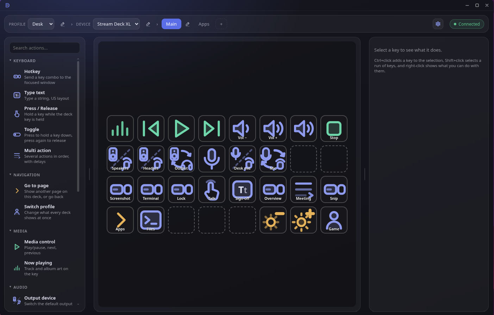
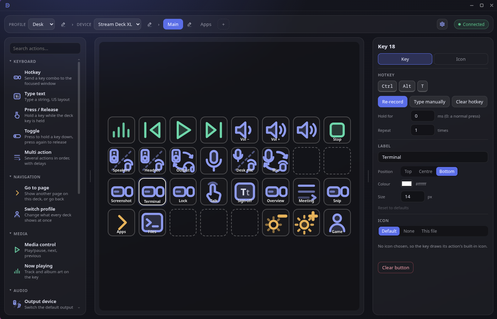
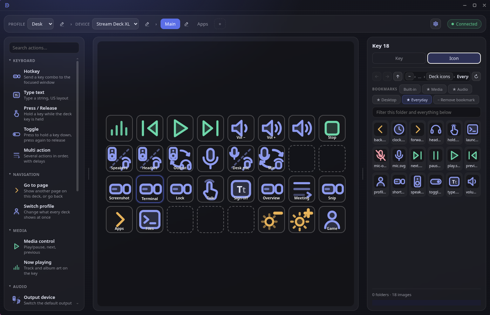
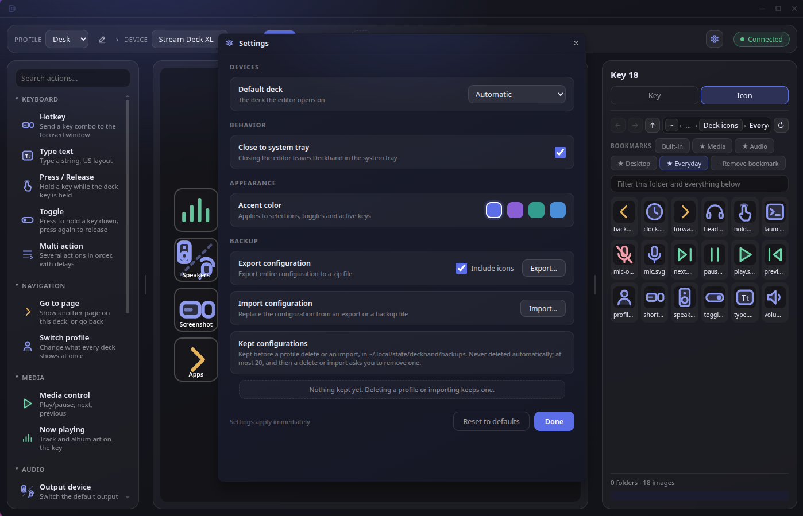

# Deckhand

Stream Deck software for Linux. A small background service drives the decks,
and an editor lets you set them up: hotkeys, audio device switching, media
controls, pages and profiles.

I built it for my own decks, because the software I was using kept breaking.
It's one person's project, used every day.



## How it's different

- **The daemon and the editor are separate programs.** The daemon drives the
  decks and sends the keys. The editor only writes a config file. A slow,
  closed or crashed editor can't delay a key press.
- **It does nothing when nothing is happening.** It waits for key presses,
  devices and players rather than checking on them. On my laptop, with music
  playing and live keys on screen, it idles at about 1% of one CPU core.
- **It's native, not a Flatpak.** It needs a udev rule, `/dev/uinput` and your
  audio and media services, which is what a sandbox exists to withhold. Keys
  come from its own virtual keyboard at the kernel's input layer, so games see
  them like a real keyboard's, games under Wine included. No permission
  prompts, and no portal to break when the desktop updates.
- **One press switches every deck.** A profile covers all your decks at once:
  one key takes the whole desk from work to a game.
- **Icons are just files on disk.** Point a key at any image. Nothing is
  copied or imported; edit the file and the key updates. A key without an
  icon draws a built-in one for its action.

## How it treats your hardware

- **Decks are known by serial number**, not by USB port. Move a deck to
  another port and its layouts go with it.
- **Any Stream Deck with screen keys should work.** The key count, layout and
  icon size come from the device, not from a list in Deckhand. I use an XL
  and an Original V2 side by side; other models haven't been tried.
- **Unplugging a deck loses nothing.** Its layouts stay in the config, and
  when you plug it back in it comes back on the active profile's start page.
  Any key it was holding down is released when it goes.

## Screenshots

Setting up a hotkey:



Choosing an icon from a folder of your own:



Settings:



## Install

Tested on Fedora 44 (KDE Plasma) and Ubuntu 26.04 (GNOME), both on Wayland.
You need Node.js 22.12 or newer from your distribution, a C compiler,
`pactl`, and a desktop session with systemd. The installer checks all of it
first, names anything missing, and offers the command to install it.

One command, as your normal user:

```bash
git -c advice.detachedHead=false clone --depth 1 --branch v0.1.0 https://github.com/juicetheforce/deckhand ~/.local/src/deckhand && ~/.local/src/deckhand/scripts/install.sh install
```

Git may print `warning: refs/tags/v0.1.0 … is not a commit!` while cloning.
It's harmless: a release is a tag rather than a branch, and the clone is
complete.

Everything installs for your user only. `sudo` is asked for once, to add a
udev rule that gives you access to the decks, and on Ubuntu once more for an
AppArmor profile the editor needs. Then open **Deckhand** from your
application menu.

To update to the newest release:

```bash
~/.local/src/deckhand/scripts/install.sh upgrade
```

To remove it: `~/.local/src/deckhand/scripts/install.sh uninstall`.

## What it doesn't do, and why

- **Switch profiles by itself when you change windows.** That needs a
  different backend for every desktop. Switch with a key, from the editor,
  or with `deckhand profile <name>` in a game's launch script.
- **Run as a Flatpak**, for the reasons above.
- **Use ydotool or the desktop portals.** It has its own virtual keyboard.
- **Plugins, a store, accounts or telemetry.** None of them.

And what it doesn't do well yet:

- **Replacing a deck.** A new deck starts blank, even the same model, because
  layouts belong to a serial number. Moving them over means editing the
  serial in the config file ([how](REFERENCE.md#using-it)).
- **Dials, the Plus's touch strip, and the Neo's extra buttons** are ignored.
- **Decks without screens, such as the Pedal**, haven't been tried and
  probably don't work.
- **Typed text assumes a US keyboard layout.**
- **Audio devices with non-English names** show their system name instead,
  because `pactl` doesn't report the description. They still work.
- **A Run command key never shows that it failed.** It starts the program
  and moves on, so a mistyped command just does nothing.

## Things I'd like to add

I build what I use, so this list changes, and nothing on it is a promise. If
you use Deckhand and something here matters to you, say so in an issue.
That's what shapes it.

- An app launcher that picks from your installed applications and uses each
  app's own icon.
- Timer keys.
- Volume for individual devices, not just the default one.
- Window actions on KDE Plasma.
- Dials and the touch strip, if I ever have a Stream Deck+ to test on.

## More

- [REFERENCE.md](REFERENCE.md): the config format, every action, the
  `deckhand` command, the control socket, troubleshooting and development.
- [ARCHITECTURE.md](ARCHITECTURE.md): why it's built the way it is.
- [SECURITY.md](SECURITY.md): reporting a security problem privately.

Bug reports are welcome as issues. I answer them when I can; feature requests
are weighed against what I use.

Licensed under the GNU General Public License, version 3 or later:
[LICENSE](LICENSE).
